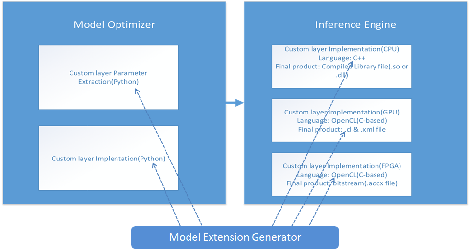

# Custom Layer Implementation Tutorial for Linux* 
**Note:** This tutorial has been tested and confirmed on Ubuntu 16.04 LTS using the Intel® Distribution of OpenVINO™ toolkit 2019 R1.  Using this tutorial with any other versions may not work correctly.

# Introduction

The purpose of this tutorial is to outline and show by example the necessary steps for implementing custom layers when using the Intel® Distribution of OpenVINO™ toolkit.  To show the base steps that apply to all custom layers, a simple custom layer performing the hyperbolic cosine function (*cosh*) will be used to show the following:

- Setting up and installing prerequisites
- Using the Model Extension Generator to generate the extension libraries and function stubs 
- Using Model Optimizer to generate the example model IR files 
- Implementing the Inference Engine extension for the example model to run on CPU and GPU 

# Before You Start

## Installation of the Intel® Distribution of OpenVINO™ toolkit 2019 R1 for Linux* 

This tutorial assumes that you have already installed the Intel® Distribution of OpenVINO™ toolkit 2019 R1 for Linux* into the default */opt/intel/openvino* directory.  If you are using a different version, please refer to the top [README.md](../README.md) to find the correct tutorial for your version.  If you have installed the toolkit to a different directory, you will need to change the directory paths that include "*/opt/intel/openvino*" in the commands below to point to your installation directory.

The Intel® Distribution of OpenVINO™ toolkit includes the Model Optimizer which is configured for use with the different model frameworks during the "Model Optimizer Configuration Steps" installation step.  As an example, this tutorial uses a TensorFlow framework model and assumes that you have already configured the Model Optimizer for use with TensorFlow.  If during installation you had not configured the Model Optimizer for all the frameworks or not for TensorFlow explicitly, please be sure to do so following the steps for [Configuring the Model Optimizer](https://docs.openvinotoolkit.org/2019_R1/_docs_MO_DG_prepare_model_Config_Model_Optimizer.html) to configure for using the TensorFlow framework.

If you need to install the Intel® Distribution of OpenVINO™ toolkit, the Linux* package can be downloaded from [Intel® Distribution of OpenVINO™ toolkit](https://software.intel.com/openvino-toolkit/choose-download/free-download-linux).  Select the "Register and Download" button to get started and then later on the "Intel® Distribution of OpenVINO™ toolkit for Linux*" download page, select "2019 R1" from the "Choose a Version" drop-down menu.  The link to the [Installation Guide](https://docs.openvinotoolkit.org/2019_R1/_docs_install_guides_installing_openvino_linux.html#install-external-dependencies) is provided on the download page.  During installation, please be sure to follow the option to configure the Model Optimizer for all frameworks (recommended), or at least include the TensorFlow framework. 

After installing the Intel® Distribution of OpenVINO™ toolkit, the *classification_sample* executable binary will be located in the directory *~/inference_engine_samples_build/intel64/Release*.  This tutorial will use the *classification_sample* executable to run the example model.

# Custom Layers
Custom layers are neural network model layers that are not natively supported by a given model framework.  This tutorial demonstrates how to run inference on topologies featuring custom layers allowing you to plug in your own implementation for existing or completely new layers.

Additional information on custom layers with the Intel® Distribution of OpenVINO™ toolkit can be found in the [Customize Model Optimizer](https://docs.openvinotoolkit.org/2019_R1/_docs_MO_DG_prepare_model_customize_model_optimizer_Customize_Model_Optimizer.html) documentation.

The list of known layers is different for each particular model framework.  To see the layers supported by the Intel® Distribution of OpenVINO™ toolkit, refer to the [Supported Frameworks Layers](https://docs.openvinotoolkit.org/latest/_docs_MO_DG_prepare_model_Supported_Frameworks_Layers.html) documentation.

*If your topology contains layers that are not in the list of known layers, the Model Optimizer considers the layers to be custom.*

The Model Optimizer searches the list of known layers for each layer contained in the input model topology before building the model's internal representation, optimizing the model, and producing the Intermediate Representation files.

## Custom Layers Implementation Workflow
When implementing a custom layer for your pre-trained model in the Intel® Distribution of OpenVINO™ toolkit, you will need to add extensions in both the Model Optimizer and the Inference Engine.  The following figure shows the workflow for the custom layer implementation with arrows pointing to what the Model Extension Generator tool will create stubs to aid implementation.



# Example custom layer: Hyperbolic Cosine (cosh) function 
We showcase custom layer implementation using the simple function hyperbolic cosine (*cosh*).  The *cosh* function is mathematically calculated as:


## Model Extension Generator
The Model Extension Generator tool generates template extension source files with stubs for each of the core functions needed by the Model Optimizer and the Inference Engine.  To complete the implementation of an extension, the stub functions must be edited to fill-in the actual custom layer functionality.

# Getting Started

## Setting Up the Environment

To begin, always ensure that your environment is properly setup for working with the Intel® Distribution of OpenVINO™ toolkit by running the command:

```bash
source /opt/intel/openvino/bin/setupvars.sh
```

## Installing Prerequisites

1. The Model Extension Generator makes use of *Cog* which is a content generator allowing the execution of embedded Python code to generate code within source files.  Install *Cog* (*cogapp*) using the command:

   ```bash
   sudo pip3 install cogapp
   ```
   
2. This tutorial will be running a Python sample from the Intel® Distribution of OpenVINO™ toolkit which needs the OpenCV library for Python to be installed.  Install the OpenCV library using the command:

   ```bash
   sudo pip3 install opencv-python
   ```

## Downloading and Setting Up the Tutorial

The first things we need to do are to create a place for the tutorial and then download it.  We will create the top directory "cl_tutorial" as the workspace to store the Git repository of the tutorial along with all the other files created.

1. Create the "cl_tutorial" top directory in the user's home directory and then change into it:
    ```bash
    cd ~
    mkdir cl_tutorial
    cd cl_tutorial
    ```
2. Download the tutorial by cloning the repository:
    ```bash
    git clone https://github.com/david-drew/OpenVINO-Custom-Layers.git
    ```
3. Create some environment variables as more convenient shorter names to the directories that will be used often:
    ```bash
    export CLWS=~/cl_tutorial
    export CLT=$CLWS/OpenVINO-Custom-Layers/2019.r1.0
    ```
    
    From here, we will now use "$CLWS" to reference the "cl_tutorial" workspace directory and "$CLT" to reference the directory containing the files for this tutorial.

## Create the TensorFlow Model (Weights, Graphs, Checkpoints):

We will use the supplied *build_cosh_model.py* script to create a simple TensorFlow model that contains the *cosh* custom layer to use with this tutorial.  The weights are random and untrained, but sufficient for demonstrating a simple custom layer implementation.  To create the model and store it in the "$CLWS/tf_model" directory, run the commands: 

   ```bash
mkdir $CLWS/tf_model
$CLT/../create_tf_model/build_cosh_model.py $CLWS/tf_model
   ```
On success, the output will appear similar to:
   ```bash
Model saved in path: /home/<user>/cl_tutorial/tf_model/model.ckpt
   ```

# Creating the cosh Custom Layer

## Generate the Template Files Using the Model Extension Generator:

We will use the Model Extension Generator tool to automatically create templates for all the various files that will be needed by the Model Optimizer to convert and the Inference Engine to execute the custom layer.  The template files will be partially replaced by Python and C++ code as necessary to implement the functionality of *cosh* as needed by the different tools.  To do this for the *cosh* custom layer, we run the Model Extension Generator with the following options:

- --mo-tf-ext = Generate a template for a Model Optimizer TensorFlow extractor
- --mo-op = Generate a template for a Model Optimizer custom layer operation
- --ie-cpu-ext = Generate a template for an Inference Engine CPU extension
- --ie-gpu-ext = Generate a template for an Inference Engine GPU extension 
- --output_dir = set the output directory.  Here we are using *$CLWS/cl_cosh* as the target directory to store the output from the Model Extension Generator.

To create the templates for the *cosh* custom layer, we run the command:

```bash
python3 /opt/intel/openvino/deployment_tools/tools/extension_generator/extgen.py new --mo-tf-ext --mo-op --ie-cpu-ext --ie-gpu-ext --output_dir=$CLWS/cl_cosh
```

The Model Extension Generator will start in interactive mode and prompt the user with questions about the custom layer to be generated.  Use the text between the []'s to answer each of the Model Extension Generator questions as follows:

```
Enter layer name: 
[Cosh]

Do you want to automatically parse all parameters from model file...(y/n)
[n]

Please enter all parameters in format
...
   Enter 'q' when finished:
[q]

Do you want to change any answer (y/n) ?
[n]

Do you want to use layer name as operation name? (y/n)
[y]

Does your operation change shape? (y/n)  
[n]

Do you want to change any answer (y/n) ?
[n]

Enter type and default value for parameters that will be read in IR in format
    ...
   Enter 'q' when finished:   
[q]

Do you want to change any answer (y/n) ?
[n]
```

 When complete, the outputted text will appear similar to the following:
```
Stub file for TensorFlow Model Optimizer extractor is in /home/<user>/cl_tutorial/cl_cosh/user_mo_extensions/front/tf folder
Stub file for Model Optimizer operation is in /home/<user>/cl_tutorial/cl_cosh/user_mo_extensions/ops folder
Stub files for Inference Engine CPU extension are in /home/<user>/cl_tutorial/cl_cosh/user_ie_extensions/cpu folder
Stub files for Inference Engine GPU extension are in /home/<user>/cl_tutorial/cl_cosh/user_ie_extensions/gpu folder
```

Stub (template) files that may need to be edited have just been created in the following locations:

- $CLWS/cl_cosh/user_mo_extensions/ops

   - cosh.py

- $CLWS/cl_cosh/user_ie_extensions/cpu

   - ext_cosh.cpp
   - CMakeLists.txt

- $CLWS/cl_cosh/user_ie_extensions/gpu

   - cosh_kernel.cl
   - cosh_kernel.xml

   **Note:** Instructions on editing the stub files are not yet provided as part of this tutorial.  For now, pre-edited stub files provided by the tutorial in the "$CLT" directory are copied and used.

## Register Custom Layer with the Model Optimizer

To perform conversion and optimization for an input model, the Model Optimizer needs a Python implementation for each layer or operation present within the input model.  The Model Extension Generator created a stub for the *cosh* custom layer which, after it has been edited to implement the *cosh* layer, needs to be put where the Model Optimizer will find it (or "registered").  To register the layer, the layer implementation is copied to the Model Optimizer operators directory */opt/intel/openvino/deployment_tools/model_optimizer/mo/ops/*.

Copy the pre-edited Python implementation of the *cosh* custom layer to the Model Optimizer operators directory using the command:

```bash
sudo cp $CLT/cosh.py /opt/intel/openvino/deployment_tools/model_optimizer/mo/ops/
```

**Note:** The *$CLT/cosh.py* file is a pre-edited version of the generated file under *$CLWS/cl_cosh/user_mo_extensions/ops/*

## Using Model Optimizer to Generate IR Containing the Custom Layer 

1. We use the Model Optimizer to convert and optimize the example TensorFlow model into IR files that will run inference using the Inference Engine.  To create the IR files we run the Model Optimizer for TensorFlow *mo_tf.py* with the following options:
   
- --input_meta_graph model.ckpt.meta
      - Specifies the model input file  
   - --batch 1
      - Explicitly sets the batch size to 1 because the example model has an input dimension of "-1".  TensorFLow allows "-1" as a variable indicating "to be filled in later", however the Model Optimizer requires explicit information for the optimization process.  
   - --output "ModCosh/Activation_8/softmax_output"
      - The full name of the final output layer.
   - --extensions $CLWS/cl_cosh/user_mo_extensions 
      - Location of the generated extension with extractor to be used by the Model Optimizer when generating the IR files.
   - --output_dir $CLWS/cl_ext_cosh
      - Location of the output IR files
  
   To create the model IR files which will include the *cosh* custom layer, we run the commands:
  
   ```bash
  cd $CLWS/tf_model
  mo_tf.py --input_meta_graph model.ckpt.meta --batch 1 --output "ModCosh/Activation_8/softmax_output" --extensions $CLWS/cl_cosh/user_mo_extensions --output_dir $CLWS/cl_ext_cosh
   ```
   On success, the output will appear similar to:
   ```
   [ SUCCESS ] Generated IR model.
   [ SUCCESS ] XML file: /home/<user>/cl_tutorial/cl_ext_cosh/model.ckpt.xml
   [ SUCCESS ] BIN file: /home/<user>/cl_tutorial/cl_ext_cosh/model.ckpt.bin
   [ SUCCESS ] Total execution time: x.xx seconds.
   ```

# Inference Engine Custom Layer Implementation for the Intel® CPU

To run the custom layer on the CPU during inference, the extension C++ source code must be compiled to create the .so shared library that implements the custom layer to be used by the Inference Engine.

1. Copy the pre-edited CPU source code to the generated Inference Engine extension for CPU directory:

   ```bash
   cp $CLT/ext_cosh.cpp $CLWS/cl_cosh/user_ie_extensions/cpu/
   ```

   **Note:** The *$CLT/ext_cosh.cpp* file is a pre-edited version of the generated file under *$CLWS/cl_cosh/user_ie_extensions/cpu/*

2. We will now compile the extension C++ library to be used by the Inference Engine to execute the *cosh* custom layer on CPU.  We will copy and use the pre-edited CMake file "$CLT/CMakeLists.txt" which includes the necessary dependencies for the implementation of the *cosh* C++ custom layer.  Run the following commands to use CMake to setup for compiling:

      ```bash
      cd $CLWS/cl_cosh/user_ie_extensions/cpu
      cp $CLT/CMakeLists.txt .
      mkdir -p build
      cd build
      cmake ..
      ```
**Note:** The *$CLT/CMakeLists.txt* file is a pre-edited version of the generated file under *$CLWS/cl_cosh/user_ie_extensions/cpu/* 
      
On success, the output will appear similar to:
      
      ```
      -- Generating done
      -- Build files have been written to: /home/<user>/cl_tutorial/cl_cosh/user_ie_extensions/cpu/build
      ```
3. The CPU extension library is now ready to be compiled.  Compile the library using the command:

      ```bash
      make -j $(nproc)
      ```
      On success, the output will appear similar to: 
      ```
      [100%] Linking CXX shared library libcosh_cpu_extension.so
      [100%] Built target cosh_cpu_extension
      ```
4. We now copy the compiled library *libcosh_cpu_extension.so* to the "$CLWS/cl_ext_cosh" directory, where the model's IR files are located, using the command: 

      ```bash
      cp libcosh_cpu_extension.so $CLWS/cl_ext_cosh/
      ```

## Testing the Results

### Using a C++ Sample

First, we will try running the C++ sample without including the *cosh* extension library to see the error describing the unsupported *cosh* operation using the command:  

```bash
~/inference_engine_samples_build/intel64/Release/classification_sample -i $CLT/../pics/dog.bmp -m $CLWS/cl_ext_cosh/model.ckpt.xml -d CPU
```

On failure, the error will be reported similar to:

```
[ ERROR ] Unsupported primitive of type: Cosh name: ModCosh/cosh/Cosh
```

We will now run the command again, this time with the *cosh* extension library specified using the "*-l $CLWS/cl_ext_cosh/libcosh_cpu_extension.so*" option in the command:

```bash
~/inference_engine_samples_build/intel64/Release/classification_sample -i $CLT/../pics/dog.bmp -m $CLWS/cl_ext_cosh/model.ckpt.xml -d CPU -l $CLWS/cl_ext_cosh/libcosh_cpu_extension.so
```

On success, the output will appear similar to:

```
Image /home/<user>/cl_tutorial/OpenVINO-Custom-Layers/pics/dog.bmp

classid probability
------- -----------
0       0.9308984  
1       0.0691015

total inference time: xx.xxxxxxx
Average running time of one iteration: xx.xxxxxxx ms
    
Throughput: xx.xxxxxxx FPS
    
[ INFO ] Execution successful
```

### Using a Python Sample

First, we will try running the Python sample without including the *cosh* extension library to see the error describing the unsupported *cosh* operation using the command:  

```bash
python3 /opt/intel/openvino/deployment_tools/inference_engine/samples/python_samples/classification_sample/classification_sample.py -i $CLT/../pics/dog.bmp -m $CLWS/cl_ext_cosh/model.ckpt.xml -d CPU
```
On failure, the error will be reported similar to:
```
[ INFO ] Loading network files:
           /home/<user>/cl_tutorial/cl_ext_cosh/model.ckpt.xml
           /home/<user>/cl_tutorial/cl_ext_cosh/model.ckpt.bin
[ ERROR ] Following layers are not supported by the plugin for specified device CPU:
    ModCosh/cosh/Cosh, ModCosh/cosh_1/Cosh, ModCosh/cosh_2/Cosh
[ ERROR ] Please try to specify cpu extensions library path in sample's command line parameters using -l or --cpu_extension command line argument
```
We will now run the command again, this time with the *cosh* extension library specified using the "*-l $CLWS/cl_ext_cosh/libcosh_cpu_extension.so*" option in the command:
```bash
python3 /opt/intel/openvino/deployment_tools/inference_engine/samples/python_samples/classification_sample/classification_sample.py -i $CLT/../pics/dog.bmp -m $CLWS/cl_ext_cosh/model.ckpt.xml -l $CLWS/cl_ext_cosh/libcosh_cpu_extension.so -d CPU
```

On success, the output will appear similar to:
```
Image /home/<user>/cl_tutorial/OpenVINO-Custom-Layers/pics/dog.bmp

classid probability
------- -----------
   0      0.9308984
   1      0.0691015
```

# Inference Engine Custom Layer Implementation for the Intel® Integrated GPU

To run the custom layer on the GPU, the source code .cl and .xml files for the associated kernel must be added to the *clDNN* library and then specified on the command line of the sample.  The .cl file is the OpenCL source code of the kernel that will be calculating the *cosh* custom layer.  The .xml file describes the custom layer kernel to the Inference Engine GPU plugin so it may use the kernel with other layers in the clDNN library when running inference on the GPU.

Copy the supplied GPU source code .cl and .xml files for the *cosh* custom kernel to the *clDNN* library folder:

```bash
sudo cp $CLT/cosh_kernel* /opt/intel/openvino/deployment_tools/inference_engine/lib/intel64/cldnn_global_custom_kernels/
```

**Note:** The *$CLT/cosh_kernel\** files are pre-edited versions of the generated files under *$CLWS/cl_cosh/user_ie_extensions/gpu/*

## Testing the Results

### Using a C++ Sample

First, we will try running the C++ sample specifying the GPU implementation without including the *cosh* kernel to see the error describing the unsupported *cosh* operation using the command:  

```bash
~/inference_engine_samples_build/intel64/Release/classification_sample -i $CLT/../pics/dog.bmp -m $CLWS/cl_ext_cosh/model.ckpt.xml -d GPU
```

On failure, the error will be reported similar to:

```
[ ERROR ] Unknown Layer Type: Cosh
```

We will now run the command again, this time with the *cosh* extension kernel specified using the "*-c /opt/intel/openvino/deployment_tools/inference_engine/lib/intel64/cldnn_global_custom_kernels/cosh_kernel.xml*" option to point to the *cosh* kernel in the command:

```bash
~/inference_engine_samples_build/intel64/Release/classification_sample -i $CLT/../pics/dog.bmp -m $CLWS/cl_ext_cosh/model.ckpt.xml -d GPU -c /opt/intel/openvino/deployment_tools/inference_engine/lib/intel64/cldnn_global_custom_kernels/cosh_kernel.xml
```
On success, the output will appear similar to:

```
Image /home/<user>/cl_tutorial/OpenVINO-Custom-Layers/pics/dog.bmp

classid probability
------- -----------
0       0.8941712  
1       0.1058289

total inference time: xx.xxxxxxx
Average running time of one iteration: xx.xxxxxxx ms

Throughput: xx.xxxxxxx FPS

[ INFO ] Execution successful
```

# Please Complete the Survey

Thank you for taking the time to follow this tutorial.  Your feedback answering this brief survey will help us to improve it:
[Intel Custom Layer Survey](https://intelemployee.az1.qualtrics.com/jfe/form/SV_1ZjOKaEIQUM5FpX)
