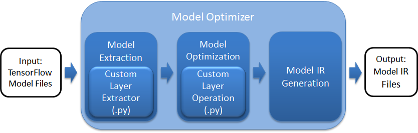
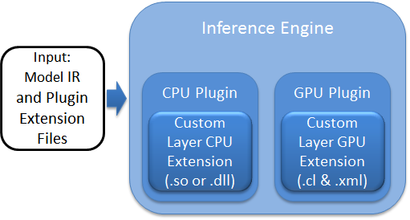
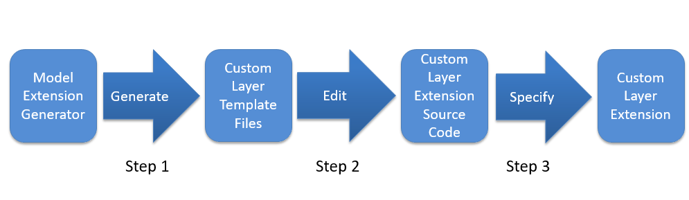
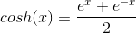

# Custom Layer Implementation Tutorial for Linux* 
**Note:** This tutorial has been tested and confirmed on Ubuntu 16.04 LTS using the Intel® Distribution of OpenVINO™ toolkit 2019 R1.1.  Using this tutorial with any other versions may not work correctly.

# Introduction

The purpose of this tutorial is to outline and show by example the necessary steps for implementing custom layers when using the Intel® Distribution of OpenVINO™ toolkit.  To show the base steps that apply to all custom layers, a simple custom layer performing the hyperbolic cosine function (*cosh*) will be used to show the following:

- Setting up and installing prerequisites
- Using the Model Extension Generator to generate the extension libraries and function stubs 
- Using Model Optimizer to generate the example model IR files 
- Implementing the Inference Engine extension for the example model to run on CPU and GPU 

# Before You Start

## Installation of the Intel® Distribution of OpenVINO™ toolkit 2019 R1.1 for Linux* 

This tutorial assumes that you have already installed the Intel® Distribution of OpenVINO™ toolkit 2019 R1.1 for Linux* into the default */opt/intel/openvino* directory.  If you are using a different version, please refer to the top [README.md](../README.md) to find the correct tutorial for your version.  If you have installed the toolkit to a different directory, you will need to change the directory paths that include "*/opt/intel/openvino*" in the commands below to point to your installation directory.

The Intel® Distribution of OpenVINO™ toolkit includes the Model Optimizer which is configured for use with the different model frameworks during the "Model Optimizer Configuration Steps" installation step.  As an example, this tutorial uses a TensorFlow framework model and assumes that you have already configured the Model Optimizer for use with TensorFlow.  If during installation you had not configured the Model Optimizer for all the frameworks or not for TensorFlow explicitly, please be sure to do so following the steps for [Configuring the Model Optimizer](https://docs.openvinotoolkit.org/2019_R1.1/_docs_MO_DG_prepare_model_Config_Model_Optimizer.html) to configure for using the TensorFlow framework.

If you need to install the Intel® Distribution of OpenVINO™ toolkit, the Linux* package can be downloaded from [Intel® Distribution of OpenVINO™ toolkit](https://software.intel.com/openvino-toolkit/choose-download/free-download-linux).  Select the "Register and Download" button to get started and then later on the "Intel® Distribution of OpenVINO™ toolkit for Linux*" download page, select "2019 R1.1" from the "Choose a Version" drop-down menu.  The link to the [Installation Guide](https://docs.openvinotoolkit.org/2019_R1.1/_docs_install_guides_installing_openvino_linux.html#install-external-dependencies) is provided on the download page.  During installation, please be sure to follow the option to configure the Model Optimizer for all frameworks (recommended), or at least include the TensorFlow framework. 

After installing the Intel® Distribution of OpenVINO™ toolkit, the *classification_sample* executable binary will be located in the directory *~/inference_engine_samples_build/intel64/Release*.  This tutorial will use the *classification_sample* executable to run the example model.

# Custom Layers
Custom layers are neural network model layers that are not natively supported by a given model framework.  This tutorial demonstrates how to run inference on topologies featuring custom layers allowing you to plug in your own implementation for existing or completely new layers.

Additional information on custom layers and the Intel® Distribution of OpenVINO™ toolkit can be found in the [Customize Model Optimizer](https://docs.openvinotoolkit.org/2019_R1.1/_docs_MO_DG_prepare_model_customize_model_optimizer_Customize_Model_Optimizer.html) documentation.

The Model Optimizer searches the list of known layers for each layer contained in the input model topology before building the model's internal representation, optimizing the model, and producing the Intermediate Representation files.  If your topology contains layers that are not in the list of known layers for the supported model framework, the Model Optimizer considers the layers to be custom.  The list of known layers is different for each specific supported model framework.  To see the framework layers that are supported by the Intel® Distribution of OpenVINO™ toolkit, refer to the [Supported Frameworks Layers](https://docs.openvinotoolkit.org/latest/_docs_MO_DG_prepare_model_Supported_Frameworks_Layers.html) documentation.

## The Custom Layer Implementation Workflow
When implementing a custom layer for your pre-trained model in the Intel® Distribution of OpenVINO™ toolkit, you will need to add extensions to both the Model Optimizer and the Inference Engine.  

## Custom Layer Extensions for the Model Optimizer 

The following figure shows the basic processing steps for the Model Optimizer highlighting the two necessary custom layer extensions, the Custom Layer Extractor and the Custom Layer Operation.




The Model Optimizer must first extract the necessary information from the input model which includes the topology of the model layers along with parameters, input and output format, etc. for each layer.  The model is then optimized from the various known characteristics of the layers, interconnects, and data flow which partly comes from the layer operation providing details including the shape of the output for each layer.  Finally, the optimized model is output to the model IR files needed by the Inference Engine to run the model.  

The Model Optimizer starts with a library of known extractors and operations for each [supported model framework](https://docs.openvinotoolkit.org/latest/_docs_MO_DG_prepare_model_Supported_Frameworks_Layers.html) which must be extended to use each unknown custom layer.  The custom layer extensions needed by the Model Optimizer are:

- Custom Layer Extractor
   - Responsible for identifying the custom layer operation for the custom layer and extracting the parameters for each instance of the custom layer.  The layer parameters are stored per instance and used by the layer operation before finally appearing in the output IR.  Typically the input layer parameters are unchanged, which is the case covered by this tutorial. 
- Custom Layer Operation
   - Responsible for specifying the attributes that are supported by the custom layer and computing the output shape for each instance of the custom layer from its parameters.  

## Custom Layer Extensions for the Inference Engine 

The following figure shows the basic flow for the Inference Engine highlighting two custom layer extensions for the CPU and GPU Plugins, the Custom Layer CPU extension and the Custom Layer GPU Extension.



Each device plugin includes a library of optimized implementations to execute known layer operations which must be extended to execute a custom layer.  The custom layer extension is implemented according to the target device:

- Custom Layer CPU Extension
   - A compiled shared library (.so or .dll binary) needed by the CPU Plugin for executing the custom layer on the CPU.
- Custom Layer GPU Extension
   - OpenCL source code (.cl) for the custom layer kernel that will be compiled to execute on the GPU along with a layer description file (.xml) needed by the GPU Plugin to be able to use the custom layer kernel.

## Model Extension Generator

Using answers to interactive questions or a *.json* configuration file, the Model Extension Generator tool generates template source code files for each of the extensions needed by the Model Optimizer and the Inference Engine.  To complete the implementation of each extension, the template functions may need to be edited to fill-in details specific to the custom layer or the actual custom layer functionality itself.

### Command-line

The Model Extension Generator is included in the Intel® Distribution of OpenVINO™ toolkit installation and is run using the command (here with the "--help" option):

```bash
python3 /opt/intel/openvino/deployment_tools/tools/extension_generator/extgen.py new --help
```

where the output will appear similar to:

```
usage: You can use any combination of the following arguments:

Arguments to configure extension generation in the interactive mode

optional arguments:
  -h, --help            show this help message and exit
  --mo-caffe-ext        generate a Model Optimizer Caffe* extractor
  --mo-mxnet-ext        generate a Model Optimizer MXNet* extractor
  --mo-tf-ext           generate a Model Optimizer TensorFlow* extractor
  --mo-op               generate a Model Optimizer operation
  --ie-cpu-ext          generate an Inference Engine CPU extension
  --ie-gpu-ext          generate an Inference Engine GPU extension
  --output_dir OUTPUT_DIR
                        set an output directory. If not specified, the current
                        directory is used by default.
```

The available command-line arguments are used to specify which extension(s) to generate templates for the Model Optimizer or Inference Engine.  The generated extension files for each argument will appear starting from the top of the output directory as follows:

| Command-line Argument | Output Directory Location      |
| --------------------- | ------------------------------ |
| --mo-caffe-ext        | user_mo_extensions/front/caffe |
| --mo-mxnet-ext        | user_mo_extensions/front/mxnet |
| --mo-tf-ext           | user_mo_extensions/front/tf    |
| --mo-op               | user_mo_extensions/ops         |
| --ie-cpu-ext          | user_ie_extensions/cpu         |
| --ie-gpu-ext          | user_ie_extensions/gpu         |

### Extension Workflow

The workflow for each generated extension follows the same basic steps:



**Step 1:** Use the Model Extension Generator to generate the Custom Layer Template Files 

**Step 2:** Edit the Custom Layer Template Files as necessary to create the specialized Custom Layer Extension Source Code

**Step 3:** Compile/Deploy the Custom Layer Extension Source Code as the Custom Layer Extension to be used by the Model Optimizer or Inference Engine

Later in this tutorial, we will go through the workflow for the following four extensions needed by the example model:

- Custom layer TensorFlow extractor extension (--mo-tf-ext)
- Custom layer operation extension (--mo-op)
- Custom layer Inference Engine CPU extension (--ie-cpu-ext)
- Custom layer Inference Engine GPU extension (--ie-gpu-ext)

# Example Custom Layer: The Hyperbolic Cosine (*cosh*) Function 

We will showcase the steps involved for implementing a custom layer using the simple hyperbolic cosine (*cosh*) function.  The *cosh* function is mathematically calculated as:



# Getting Started

## Setting Up the Environment

To begin, always ensure that your environment is properly setup for working with the Intel® Distribution of OpenVINO™ toolkit by running the command:

```bash
source /opt/intel/openvino/bin/setupvars.sh
```

## Installing Prerequisites

1. The Model Extension Generator makes use of *Cog* which is a content generator allowing the execution of embedded Python code to generate code within source files.  Install *Cog* (*cogapp*) using the command:

   ```bash
   sudo pip3 install cogapp
   ```
   
2. This tutorial will be running a Python sample from the Intel® Distribution of OpenVINO™ toolkit which needs the OpenCV library for Python to be installed.  Install the OpenCV library using the command:

   ```bash
   sudo pip3 install opencv-python
   ```

## Downloading and Setting Up the Tutorial

The first things we need to do are to create a place for the tutorial and then download it.  We will create the top directory "cl_tutorial" as the workspace to store the Git repository of the tutorial along with all the other files created.

1. Create the "cl_tutorial" top directory in the user's home directory and then change into it:
    ```bash
    cd ~
    mkdir cl_tutorial
    cd cl_tutorial
    ```
2. Download the tutorial by cloning the repository:
    ```bash
    git clone https://github.com/david-drew/OpenVINO-Custom-Layers.git
    ```
3. Create some environment variables as more convenient shorter names to the directories that will be used often:
    ```bash
    export CLWS=~/cl_tutorial
    export CLT=$CLWS/OpenVINO-Custom-Layers/2019.r1.1
    ```
    
    From here, we will now use "$CLWS" to reference the "cl_tutorial" workspace directory and "$CLT" to reference the directory containing the files for this tutorial.

## Create the Example TensorFlow Model (Weights, Graphs, Checkpoints):

We will use the supplied *build_cosh_model.py* script to create a simple TensorFlow model that contains the *cosh* custom layer to use with this tutorial.  The weights are random and untrained, but sufficient for demonstrating a simple custom layer implementation.  To create the model and store it in the "$CLWS/tf_model" directory, run the commands: 

   ```bash
mkdir $CLWS/tf_model
$CLT/../create_tf_model/build_cosh_model.py $CLWS/tf_model
   ```
On success, the output will appear similar to:
   ```
Model saved in path: /home/<user>/cl_tutorial/tf_model/model.ckpt
   ```

# Creating the *cosh* Custom Layer

## Generate the Extension Template Files Using the Model Extension Generator

We will use the Model Extension Generator tool to automatically create templates for all the extensions that will be needed by the Model Optimizer to convert and the Inference Engine to execute the custom layer.  The extension template files will be partially replaced by Python and C++ code to implement the functionality of *cosh* as needed by the different tools.  To create the four extensions for the *cosh* custom layer, we run the Model Extension Generator with the following options:

- --mo-tf-ext = Generate a template for a Model Optimizer TensorFlow extractor
- --mo-op = Generate a template for a Model Optimizer custom layer operation
- --ie-cpu-ext = Generate a template for an Inference Engine CPU extension
- --ie-gpu-ext = Generate a template for an Inference Engine GPU extension 
- --output_dir = set the output directory.  Here we are using *$CLWS/cl_cosh* as the target directory to store the output from the Model Extension Generator.

To create the four extension templates for the *cosh* custom layer, we run the command:

```bash
python3 /opt/intel/openvino/deployment_tools/tools/extension_generator/extgen.py new --mo-tf-ext --mo-op --ie-cpu-ext --ie-gpu-ext --output_dir=$CLWS/cl_cosh
```

The Model Extension Generator will start in interactive mode and prompt the user with questions about the custom layer to be generated.  Use the text between the []'s to answer each of the Model Extension Generator questions as follows:

```
Enter layer name: 
[cosh]

Do you want to automatically parse all parameters from the model file? (y/n)
...
[n]

Enter all parameters in the following format:
...
Enter 'q' when finished:
[q]

Do you want to change any answer (y/n) ? Default 'no'
[n]

Do you want to use the layer name as the operation name? (y/n)
[y]

Does your operation change shape? (y/n)  
[n]

Do you want to change any answer (y/n) ? Default 'no'
[n]
```

 When complete, the outputted text will appear similar to the following:
```
Stub file for TensorFlow Model Optimizer extractor is in /home/<user>/cl_tutorial/cl_cosh/user_mo_extensions/front/tf folder
Stub file for the Model Optimizer operation is in /home/<user>/cl_tutorial/cl_cosh/user_mo_extensions/ops folder
Stub files for the Inference Engine CPU extension are in /home/<user>/cl_tutorial/cl_cosh/user_ie_extensions/cpu folder
Stub files for the Inference Engine GPU extension are in /home/<user>/cl_tutorial/cl_cosh/user_ie_extensions/gpu folder
```

Template files (containing source code stubs) that may need to be edited have just been created in the following locations:

- TensorFlow Model Optimizer extractor extension: 
   - $CLWS/cl_cosh/user_mo_extensions/front/tf/
      - cosh_ext.py
- Model Optimizer operation extension:
   - $CLWS/cl_cosh/user_mo_extensions/ops
      - cosh.py
- Inference Engine CPU extension:
   - $CLWS/cl_cosh/user_ie_extensions/cpu
      - ext_cosh.cpp
      - CMakeLists.txt
- Inference Engine GPU extension:
   - $CLWS/cl_cosh/user_ie_extensions/gpu
      - cosh_kernel.cl
      - cosh_kernel.xml

Instructions on editing the template files are provided in later parts of this tutorial.  For reference, or to copy to make the changes quicker, pre-edited template files are provided by the tutorial in the "$CLT" directory.

## Using Model Optimizer to Generate IR Files Containing the Custom Layer 

We will now use the generated extractor and operation extensions with the Model Optimizer to generate the model IR files needed by the Inference Engine.  The necessary steps that will be covered are:

1. Edit the extractor extension template file
2. Edit the operation extension template file
3. Generate the Model IR Files

### Edit the Extractor Extension Template File

For the *cosh* custom layer, the generated extractor extension does not need to be modified because the layer parameters are used without modification.  Below is a walkthrough of the Python code for the extractor extension that appears in the file  *$CLWS/cl_cosh/user_mo_extensions/front/tf/cosh_ext.py*.
1. Using your favorite text editor, open the extractor extension source file *$CLWS/cl_cosh/user_mo_extensions/front/tf/cosh_ext.py*
2. The class is defined with the unique name *coshFrontExtractor* that inherits from the base extractor *FrontExtractorOp* class.  The class variable *op* is set to the name of the layer operation and *enabled* is set to whether the Model Optimizer should use (*True*) or exclude (*False*) the layer during processing.
```python
class coshFrontExtractor(FrontExtractorOp):
    op = 'cosh' 
    enabled = True
```
2. The *extract* function is overridden to allow modifications to be made while extracting parameters from layers within the input model.
```python
    @staticmethod
    def extract(node):
```
3. The layer parameters are extracted from the input model and stored in *param*.  This is where the layer parameters in *param* may be retrieved and used as needed.  For the *cosh* custom layer, the "*op*" attribute is simply set to the name of the operation extension to use.
```python
        proto_layer = node.pb
        param = proto_layer.attr
        # extracting parameters from TensorFlow layer and prepare them for IR
        attrs = {
            'op': __class__.op
        }
```
4. The attributes for the specific node are updated.  This is where modifying or creating attributes in *attrs* may be done before updating *node* with the results and the *enabled* class variable is returned.

```python
        # update the attributes of the node
        Op.get_op_class_by_name(__class__.op).update_node_stat(node, attrs)
    
        return __class__.enabled
```
### Edit the Operation Extension Template File

For the *cosh* custom layer, the generated operation extension does not need to be modified because the shape (i.e. dimensions) of the layer output is the same as the input shape.  Below is a walkthrough of the Python code for the operation extension that appears in the file  *$CLWS/cl_cosh/user_mo_extensions/ops/cosh.py*.
1. Using your favorite text editor, open the operation extension source file *$CLWS/cl_cosh/user_mo_extensions/ops/cosh.py*
2. The class is defined with the unique name *coshOp* that inherits from the base operation *Op* class.  The class variable *op* is set to "*cosh*", the name of the layer operation
```python
class coshOp(Op):
    op = 'cosh'
```
2. The *coshOp* class initializer *\__init__* function will be called for each layer created.  The initializer must initialize the super class *Op* by passing the *graph* and *attrs* arguments along with a dictionary of the mandatory properties for the *cosh* operation layer that define the type (*type*), operation (*op*), and inference function (*infer*).   This is where any other initialization needed by the *coshOP* operation may also be done.
```python
    def __init__(self, graph, attrs):
        mandatory_props = dict(
            type=__class__.op,
            op=__class__.op,
            
            infer=coshOp.infer            
        )
        super().__init__(graph, mandatory_props, attrs)
```
3. The *infer* function is defined to provide the Model Optimizer information on a layer, specifically returning the shape of the layer output for each node.  Here, the layer output shape is the same as the input and the value of the helper function *copy_shape_infer(node)* is returned.
```python
    @staticmethod
    def infer(node: Node):
        # ==========================================================
        # You should add your shape calculation implementation here
        # If a layer input shape is different to the output one
        # it means that it changes shape and you need to implement
        # it on your own. Otherwise, use copy_shape_infer(node).
        # ==========================================================
        return copy_shape_infer(node)
```

### Generate the Model IR Files

With the extensions now complete, we use the Model Optimizer to convert and optimize the example TensorFlow model into IR files that will run inference using the Inference Engine.  To create the IR files, we run the Model Optimizer for TensorFlow *mo_tf.py* with the following options:

- --input_meta_graph model.ckpt.meta
  
   - Specifies the model input file  
   
- --batch 1
  
   - Explicitly sets the batch size to 1 because the example model has an input dimension of "-1".  TensorFLow allows "-1" as a variable indicating "to be filled in later", however the Model Optimizer requires explicit information for the optimization process.  
- --output "ModCosh/Activation_8/softmax_output"

   - The full name of the final output layer of the model

- --extensions $CLWS/cl_cosh/user_mo_extensions 

   - Location of the extractor and operation extensions for the custom layer to be used by the Model Optimizer during model extraction and optimization 

- --output_dir $CLWS/cl_ext_cosh

   - Location to write the output IR files

   To create the model IR files that will include the *cosh* custom layer, we run the commands:

   ```bash
   cd $CLWS/tf_model
   mo_tf.py --input_meta_graph model.ckpt.meta --batch 1 --output "ModCosh/Activation_8/softmax_output" --extensions $CLWS/cl_cosh/user_mo_extensions --output_dir $CLWS/cl_ext_cosh
   ```
    On success, the output will appear similar to:
    ```
    [ SUCCESS ] Generated IR model.
    [ SUCCESS ] XML file: /home/<user>/cl_tutorial/cl_ext_cosh/model.ckpt.xml
    [ SUCCESS ] BIN file: /home/<user>/cl_tutorial/cl_ext_cosh/model.ckpt.bin
    [ SUCCESS ] Total execution time: x.xx seconds.
    ```

# Inference Engine Custom Layer Implementation for the Intel® CPU

We will now use the generated CPU extension with the Inference Engine to execute the custom layer on the CPU.  The necessary steps that will be covered are:

1. Edit the CPU extension template files
2. Compile the CPU extension library
3. Execute the Model with the custom layer

## Edit the CPU Extension Template Files

The generated CPU extension includes the template file *ext_cosh.cpp* that must be edited to fill-in the functionality of the *cosh* custom layer for when it is executed by the Inference Engine.  The *CMakeLists.txt* file will also need to be edited to add any header file or library dependencies required to compile the CPU extension.  In the next sections, we will edit and walk through these files.

**Note:** For reference, or to copy to make the changes quicker, pre-edited *CMakeLists.txt* and *ext_cosh.cpp* files are provided by the tutorial in the "$CLT" directory.

#### Edit *ext_cosh.cpp*

We will now edit the *ext_cosh.cpp* by walking through the code and making the necessary changes for the *cosh* custom layer along the way.

1. Using your favorite text editor, open the CPU extension source file *$CLWS/cl_cosh/user_ie_extensions/cpu/ext_cosh.cpp*

2. To implement the *cosh* function to efficiently execute in parallel, the code will use the parallel processing supported by the Inference Engine through the use of the Intel® Threading Building Blocks library.  To use the library, at the top we must include the necessary header [ie_parallel.hpp](https://docs.openvinotoolkit.org/2019_R1.1/ie__parallel_8hpp.html) file by adding the *#include* line as shown below.

   Before:

   ```cpp
   #include "ext_base.hpp"
   #include <cmath>
   ```

   After:
   ```cpp
   #include "ext_base.hpp"
   #include "ie_parallel.hpp"
   #include <cmath>
   ```

3. The class *coshImp* implements the *cosh* custom layer and inherits from the extension layer base class *ExtLayerBase*.  
   ```cpp
   class coshImpl: public ExtLayerBase {
   public:
   ```
   
4. The *coshImpl* constructor is passed the *layer* object that it is associated with to provide access to any layer parameters that may need to be read or set when implementing the specific instance of the custom layer.    
   ```cpp
       explicit coshImpl(const CNNLayer* layer) {
           try {
              ...
   ```
   
5. The main responsibility of the *coshImpl* constructor is to configure the input and output data layout for the custom layer by calling *addConfig()*.  In the template file, the line is commented-out and we will replace it to indicate that *layer* uses *DataConfigurator(ConfLayout::PLN)* (plain, or linear) data for both input and output.
   
   Before:
   
   ```cpp
               ...
               // addConfig({DataConfigurator(ConfLayout::PLN), DataConfigurator(ConfLayout::PLN)}, {DataConfigurator(ConfLayout::PLN)});
   
   ```
   
   After:
   
   ```cpp
               addConfig(layer, { DataConfigurator(ConfLayout::PLN) }, { DataConfigurator(ConfLayout::PLN) });
   ```
   
6. The construct is now complete, catching and reporting certain exceptions that may have been thrown before exiting.
   ```cpp
           } catch (InferenceEngine::details::InferenceEngineException &ex) {
               errorMsg = ex.what();
           }
       }
   ```

7. The *execute* method is overridden to implement the functionality of the *cosh* custom layer.  The *inputs* and *outputs* are the data buffers passed as [Blob](https://docs.openvinotoolkit.org/2019_R1.1/_docs_IE_DG_Memory_primitives.html) objects. The template file will simply return *NOT_IMPLEMENTED* by default.  To calculate the *cosh* custom layer, we will replace the *execute* method with the necessary code to efficiently calculate the *cosh* function in parallel using the [parallel_for3d](https://docs.openvinotoolkit.org/2019_R1.1/ie__parallel_8hpp.html) function.
   
   Before:
   
   ```cpp
       StatusCode execute(std::vector<Blob::Ptr>& inputs, std::vector<Blob::Ptr>& outputs,
                       ResponseDesc *resp) noexcept override {
        // Add here implementation for layer inference
        // Examples of implementations you can find in Inerence Engine tool samples/extenstions folder
        return NOT_IMPLEMENTED;
   ```
   
   After:
   ```cpp
       StatusCode execute(std::vector<Blob::Ptr>& inputs, std::vector<Blob::Ptr>& outputs,
                       ResponseDesc *resp) noexcept override {
        // Add implementation for layer inference here
        // Examples of implementations are in OpenVINO samples/extensions folder
          
        // Get pointers to source and destination buffers
        float* src_data = inputs[0]->buffer();
        float* dst_data = outputs[0]->buffer();
   
        // Get the dimensions from the input (output dimensions are the same)
        SizeVector dims = inputs[0]->getTensorDesc().getDims();
          
        // Get dimensions:N=Batch size, C=Number of Channels, H=Height, W=Width
        int N = static_cast<int>((dims.size() > 0) ? dims[0] : 1);
        int C = static_cast<int>((dims.size() > 1) ? dims[1] : 1);
        int H = static_cast<int>((dims.size() > 2) ? dims[2] : 1);
        int W = static_cast<int>((dims.size() > 3) ? dims[3] : 1);
   
        // Perform (in parallel) the hyperbolic cosine given by: 
        //    cosh(x) = (e^x + e^-x)/2
        parallel_for3d(N, C, H, [&](int b, int c, int h) {
            // Fill output_sequences with -1
            for (size_t ii = 0; ii < b*c; ii++) {
                dst_data[ii] = (exp(src_data[ii]) + exp(-src_data[ii]))/2;
            }
        });
        return OK;
    }
   ```

#### Edit *CMakeLists.txt*

Because the implementation of the *cosh* custom layer makes use of the parallel processing supported by the Inference Engine, we need to add the Intel® Threading Building Blocks dependency to *CMakeLists.txt* before being able to compile.  To do this we will add paths to the header and library files and add the Intel® Threading Building Blocks library to the list of link libraries.  We will also rename the *.so* along the way.

1. Using your favorite text editor, open the CPU extension CMake file *$CLWS/cl_cosh/user_ie_extensions/cpu/CMakeLists.txt*
2. At the top, rename the *TARGET_NAME* so that the compiled library will be named "libcosh_cpu_extension.so":

   Before:
   
   ```cmake
   set(TARGET_NAME "user_cpu_extension")
   ```

   After:
   ```cmake
   set(TARGET_NAME "cosh_cpu_extension")
   ```

3. We modify the *include_directories* to add the header include path for the Intel® Threading Building Blocks library located in the Intel® Distribution of OpenVINO™ installation at *toolkit/opt/intel/openvino/deployment_tools/inference_engine/external/tbb/include*:

   Before:
   
   ```cmake
   include_directories (PRIVATE
      ${CMAKE_CURRENT_SOURCE_DIR}/common
      ${InferenceEngine_INCLUDE_DIRS}
   )
   ```

   After:
   ```cmake
   include_directories (PRIVATE
      ${CMAKE_CURRENT_SOURCE_DIR}/common
      ${InferenceEngine_INCLUDE_DIRS}
      "/opt/intel/openvino/deployment_tools/inference_engine/external/tbb/include"
   )
   ```
4. We need to add the *link_directories* with the path to the Intel® Threading Building Blocks library binaries at */opt/intel/openvino/deployment_tools/inference_engine/external/tbb/lib*

   Before:
   
   ```cmake
   ...
   #enable_omp()
   ```
   
   After:
   ```cmake
   ...
   link_directories(
   "/opt/intel/openvino/deployment_tools/inference_engine/external/tbb/lib"
   )
   #enable_omp()
   ```
5. Finally, we add the Intel® Threading Building Blocks library "*tbb*" to the list of link libraries in *target_link_libraries*:

   Before:
   
   ```cmake
   target_link_libraries(${TARGET_NAME} ${InferenceEngine_LIBRARIES} ${intel_omp_lib})
   ```
   
   After:
   ```cmake
   target_link_libraries(${TARGET_NAME} ${InferenceEngine_LIBRARIES} ${intel_omp_lib} tbb)
   ```

## Compile the Extension Library

To run the custom layer on the CPU during inference, the edited extension C++ source code must be compiled to create a *.so* shared library to be used by the Inference Engine.  In the following steps, we will now compile the extension C++ library.

1. First, we run the following commands to use CMake to setup for compiling:

      ```bash
      cd $CLWS/cl_cosh/user_ie_extensions/cpu
      mkdir -p build
      cd build
      cmake ..
      ```
      
      On success, the output will appear similar to:     

      ```
      -- Generating done
      -- Build files have been written to: /home/<user>/cl_tutorial/cl_cosh/user_ie_extensions/cpu/build
      ```

2. The CPU extension library is now ready to be compiled.  Compile the library using the command:

      ```bash
      make -j $(nproc)
      ```
      On success, the output will appear similar to: 
      ```
      [100%] Linking CXX shared library libcosh_cpu_extension.so
      [100%] Built target cosh_cpu_extension
      ```

## Execute the Model with the Custom Layer

### Using a C++ Sample

First, we will try running the C++ sample without including the *cosh* extension library to see the error describing the unsupported *cosh* operation using the command:  

```bash
~/inference_engine_samples_build/intel64/Release/classification_sample -i $CLT/../pics/dog.bmp -m $CLWS/cl_ext_cosh/model.ckpt.xml -d CPU
```

On failure, the error will be reported similar to:

```
[ ERROR ] Unsupported primitive of type: cosh name: ModCosh/cosh/Cosh
```

We will now run the command again, this time with the *cosh* extension library specified using the "*-l $CLWS/cl_cosh/user_ie_extensions/cpu/build/libcosh_cpu_extension.so*" option in the command:

```bash
~/inference_engine_samples_build/intel64/Release/classification_sample -i $CLT/../pics/dog.bmp -m $CLWS/cl_ext_cosh/model.ckpt.xml -d CPU -l $CLWS/cl_cosh/user_ie_extensions/cpu/build/libcosh_cpu_extension.so
```

On success, the output will appear similar to:

```
Image /home/<user>/cl_tutorial/OpenVINO-Custom-Layers/pics/dog.bmp

classid probability
------- -----------
0       0.9308984  
1       0.0691015

total inference time: xx.xxxxxxx
Average running time of one iteration: xx.xxxxxxx ms
    
Throughput: xx.xxxxxxx FPS
    
[ INFO ] Execution successful
```

### Using a Python Sample

First, we will try running the Python sample without including the *cosh* extension library to see the error describing the unsupported *cosh* operation using the command:  

```bash
python3 /opt/intel/openvino/deployment_tools/inference_engine/samples/python_samples/classification_sample/classification_sample.py -i $CLT/../pics/dog.bmp -m $CLWS/cl_ext_cosh/model.ckpt.xml -d CPU
```
On failure, the error will be reported similar to:
```
[ INFO ] Loading network files:
           /home/<user>/cl_tutorial/cl_ext_cosh/model.ckpt.xml
           /home/<user>/cl_tutorial/cl_ext_cosh/model.ckpt.bin
[ ERROR ] Following layers are not supported by the plugin for specified device CPU:
    ModCosh/cosh/Cosh, ModCosh/cosh_1/Cosh, ModCosh/cosh_2/Cosh
[ ERROR ] Please try to specify cpu extensions library path in sample's command line parameters using -l or --cpu_extension command line argument
```
We will now run the command again, this time with the *cosh* extension library specified using the "*-l $CLWS/cl_cosh/user_ie_extensions/cpu/build/libcosh_cpu_extension.so*" option in the command:
```bash
python3 /opt/intel/openvino/deployment_tools/inference_engine/samples/python_samples/classification_sample/classification_sample.py -i $CLT/../pics/dog.bmp -m $CLWS/cl_ext_cosh/model.ckpt.xml -l $CLWS/cl_cosh/user_ie_extensions/cpu/build/libcosh_cpu_extension.so -d CPU
```

On success, the output will appear similar to:
```
Image /home/<user>/cl_tutorial/OpenVINO-Custom-Layers/pics/dog.bmp

classid probability
------- -----------
   0      0.9308984
   1      0.0691015
```

# Inference Engine Custom Layer Implementation for the Intel® Integrated GPU

We will now use the generated GPU extension with the Inference Engine to execute the custom layer on the GPU.  The necessary steps that will be covered are:

1. Edit the GPU extension template files
2. Execute the Model with the custom layer

## Edit the GPU Extension Template Files

The generated GPU extension includes the source template file *cosh_kernel.cl* that must be edited to fill-in the functionality of the *cosh* custom layer kernel for when it is executed by the Inference Engine.  The *cosh_kernel.xml* file will also need to be edited to correctly describe the kernel for it to be used by the GPU Plugin for the Inference Engine.  In the next sections, we will edit and walk through these files.

**Note:** For reference, or to copy to make the changes quicker, pre-edited *cosh_kernel.cl* and *cosh_kernel.xml* files are provided by the tutorial in the "$CLT" directory.

### Edit *cosh_kernel.cl*

We will now edit the *cosh_kernel.cl* by walking through the code and making the necessary changes for the *cosh* custom layer kernel along the way.

1. Using your favorite text editor, open the GPU extension source file *$CLWS/cl_cosh/user_ie_extensions/gpu/cosh_kernel.cl*

2. To *cosh_kernel* kernel implements the functionality of the *cosh* custom layer.  The kernel arguments need to be added for each input and output and the body of the kernel filled-in with the layer functionality.  To calculate the *cosh* custom layer, we will replace the kernel arguments and body with the necessary code to calculate the *cosh* function as shown.

   Before:

   ```c
   __kernel void cosh_kernel(
        // insert pointers to inputs, outputs as arguments here
        // if your layer have one input and one output, argumants will be:
        //     const __global INPUT0_TYPE*  input0, __global OUTPUT0_TYPE* output
        )
   {
       // Here kernel implementation should be added!
   }
   ```

   After:

   ```c
   __kernel void cosh_kernel(
        // Insert pointers to inputs, outputs as arguments here
        // If your layer has one input and one output, arguments will be:
             const __global INPUT0_TYPE*  input0, __global OUTPUT0_TYPE* output
        )
   {
       // Add the kernel implementation here:
       
       // Get data dimensions
       int T_ = INPUT0_DIMS[0];
       int N_ = INPUT0_DIMS[1];
   
       // Perform the hyperbolic cosine given by: 
       //    cosh(x) = (e^x + e^-x)/2
       for (int ii = 0; ii < T_*N_; ii++) 
       {
           output[ii] = (OUTPUT0_TYPE)(exp(input0[ii]) + exp(-input0[ii]))/2;
       }
   }
   ```

### Edit *cosh_kernel.xml*

For the Inference Engine to run the *cosh* custom layer kernel on the GPU, more detail is needed which is contained in the *cosh_kernel.xml*.  We will now walk through and edit the *cosh_kernel.xml* to describe the kernel in *cosh_kernel.cl*.

1. Using your favorite text editor, open the GPU extension source file *$CLWS/cl_cosh/user_ie_extensions/gpu/cosh_kernel.xml*

2. The kernel description starts with the *CustomLayer* element with the *name* attribute specifying the name of the custom layer and the *type* attribute specifying the type of layer.
   
   ```xml
   <CustomLayer name="cosh" type="SimpleGPU" version="1">
   ```
   
3. The *Kernel* element indicates the name of the kernel function, the file the kernel is located in, and any parameter descriptions if needed.  The *Kernel* element's *entry* attribute specifies the name of the kernel function.  The *Source* child-element's *filename* attribute then specifies the file containing the kernel.
   ```xml
   <Kernel entry="cosh_kernel">
        <Source filename="cosh_kernel.cl"/>
        <!-- Parameters description /-->
   </Kernel>
   ```
   
4. Within the *Buffers* element, each argument of the *cosh* kernel needs to be specified as a *Tensor* element with the following attributes set:
   
   - *arg-index* =  Argument position in the kernel's argument list starting from 0
   - *type* = Whether the argument is "input" (read-only) or "output" (writeable)
   - *port-index* = Which memory port of the device the argument should use
   - *format* = Data format (i.e. dimensions) of argument in memory, for *cosh* we use the simple "*BFXY*"
   
   For the *cosh* kernel, we make the changes as shown:
   
   Before:
   
   ```xml
       <Buffers>
           <!--Tensor arg-index="0" type="input" port-index="0"  format="BFYX"/-->
           <!--Tensor arg-index="1" type="output" port-index="0" format="BFYX"/-->
       </Buffers>
   ```
   
   After:
   ```xml
       <Buffers>
           <Tensor arg-index="0" type="input" port-index="0" format="BFYX"/>
           <Tensor arg-index="1" type="output" port-index="1" format="BFYX"/>
       </Buffers>
   ```
   
5. The *CompilerOptions* element specifies the compiler options for when the kernel source code is compiled.  By default, the "-cl-mad-enable" (allow multiply-then-add replacement with lower-precision "mad" operator) option is enabled.
   ```xml
       <CompilerOptions options="-cl-mad-enable"/>
   ```

6. We need to specify the worksize for the *cosh* kernel using the *WorkSizes* element which is commented-out by default.  Here we use the *global* attribute to specify the two-dimensional worksize of "*B,F*" (Batch x Frame) to be used with the *cosh* kernel:
   
   Before:
   
   ```xml
       <!-- define the global worksize. The formulas can use the values of the B,F,Y,X dimensions and contain the operators: +,-,/,*,% 
         (all evaluated in integer arithmetics). Default value: global="B*F*Y*X,1,1"/-->
       <!--WorkSizes global="X,Y,B*F"/--> 
   ```
   
   After:
   ```xml
       <!-- define the global worksize. The formulas can use the values of the B,F,Y,X dimensions and contain the operators: +,-,/,*,% 
            (all evaluated in integer arithmetics). Default value: global="B*F*Y*X,1,1"/-->
       <WorkSizes global="B,F"/>
   ```
   
7. The *CustomLayer* describing the kernel is complete.
   ```xml
   </CustomLayer>
   ```

## Execute the Model with the Custom Layer

### Using a C++ Sample

First, we will try running the C++ sample specifying the GPU implementation without including the *cosh* kernel to see the error describing the unsupported *cosh* operation using the command:  

```bash
~/inference_engine_samples_build/intel64/Release/classification_sample -i $CLT/../pics/dog.bmp -m $CLWS/cl_ext_cosh/model.ckpt.xml -d GPU
```

On failure, the error will be reported similar to:

```
[ ERROR ] Unknown Layer Type: cosh
```

We will now run the command again, this time with the *cosh* extension kernel specified using the "*-c $CLWS/cl_cosh/user_ie_extensions/gpu/cosh_kernel.xml*" option to point to the *cosh* kernel in the command:

```bash
~/inference_engine_samples_build/intel64/Release/classification_sample -i $CLT/../pics/dog.bmp -m $CLWS/cl_ext_cosh/model.ckpt.xml -d GPU -c $CLWS/cl_cosh/user_ie_extensions/gpu/cosh_kernel.xml
```
On success, the output will appear similar to:

```
Image /home/<user>/cl_tutorial/OpenVINO-Custom-Layers/pics/dog.bmp

classid probability
------- -----------
0       0.8941712  
1       0.1058289

total inference time: xx.xxxxxxx
Average running time of one iteration: xx.xxxxxxx ms

Throughput: xx.xxxxxxx FPS

[ INFO ] Execution successful
```

# Please Complete the Survey

Thank you for taking the time to follow this tutorial.  Your feedback answering this brief survey will help us to improve.

Those respondents who leave their info will be entered in a drawing for a **Neural Compute Stick 2** (2 being given away) or a **$25 Gift Certificate** (5 being given away):
[Intel Custom Layer Survey](https://intelemployee.az1.qualtrics.com/jfe/form/SV_1ZjOKaEIQUM5FpX)